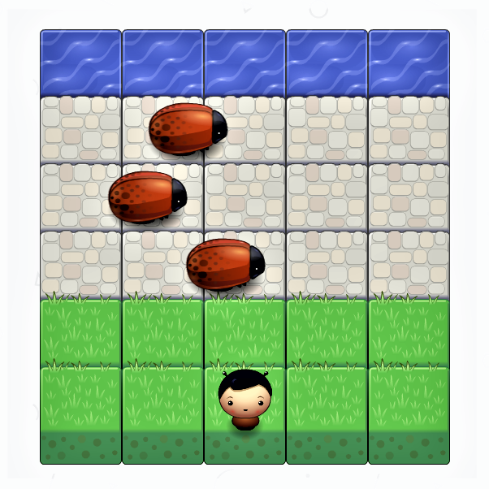

# Classic Arcade Game :

## Installation :-

* Download ZIP on the right Side of the screen, then extract the zip file to your computer, or clone the repository using git.

* Open *index.html* in Your Browser And You Can Play.

* OR You Can Play Here :- https://harshal1046.github.io/ArcadeGame/

## How To Play Game :-

* Use the arrow keys to move Player.

* The objective is to reach the water.

* Avoid the bugs, they kill you And You've To start From Beginning.

## Images :

